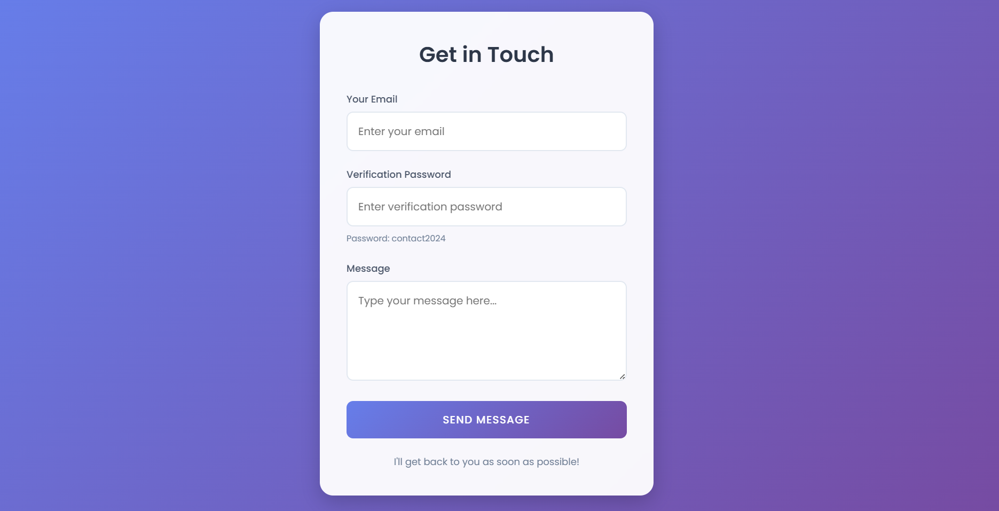

# Email Notification Service

A robust Node.js email notification service using Nodemailer, Handlebars, and Winston.

## Setup

1. Clone the repo and run `npm install`.
2. Create a `.env` file with your email credentials.
3. Run `npm start` to send a test email.

## Project Structure

- `src/config`: Configuration management
- `src/services`: Email service logic
- `src/templates`: Handlebars email templates
- `src/utils`: Logger utility
- `test`: Tests

## Usage

Edit `src/index.js` to customize email sending logic.

## Contact Form UI

 
